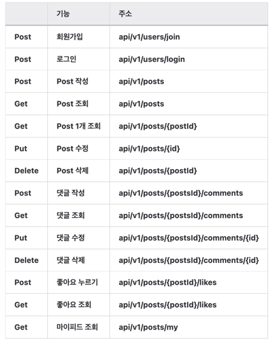
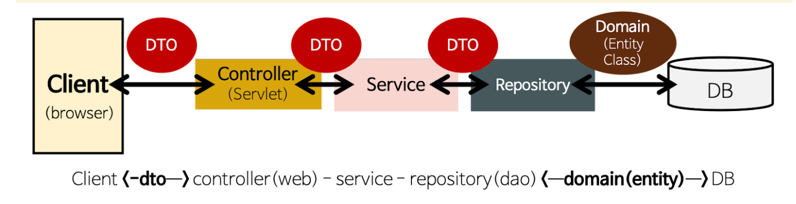
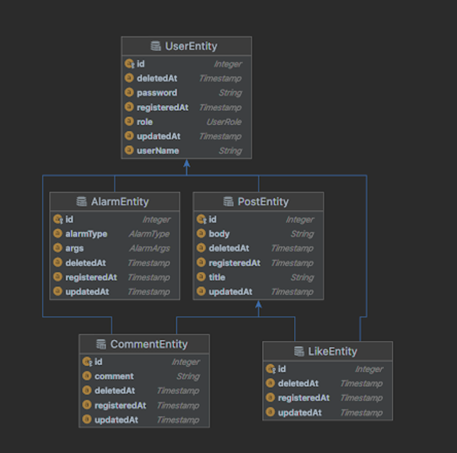

# 멋사SNS (MustsaSNS)

## ✅ 프로젝트 요구사항
1️⃣ 로그인   
2️⃣ 회원가입   
3️⃣ 글 작성/수정/삭제/리스트    
4️⃣ 댓글 작성/수정/삭제/리스트    
5️⃣ 좋아요    
6️⃣ 알람    
7️⃣ 마이피드    

1️⃣~4️⃣, 7️⃣ 완 

## 🔧개발환경
- 에디터 : Intellij
- 자바 : 11
- 개발 툴 : SpringBoot 2.7.5
- 서버 : AWS EC2
- 배포 : Docker
- 데이터베이스 : MySql 8
- 필수 라이브러리 : SpringBoot Web, Lombok , MySQL, Spring Data JPA, Spring Security

## ENDPOINT

## 아키텍쳐

## ERD

## 😢아쉬운 점 & 보안할 점
1. 기능 구현에 집중한다고 테스트코드를 거의 못했다. 팀프로젝트 전에 테스트코드에 시간을 많이 쏟아야 할 것 같다
2. 리팩토핑 할 게 눈에 보이는 것도 있었는데 꼼꼼하게 하지 못했다